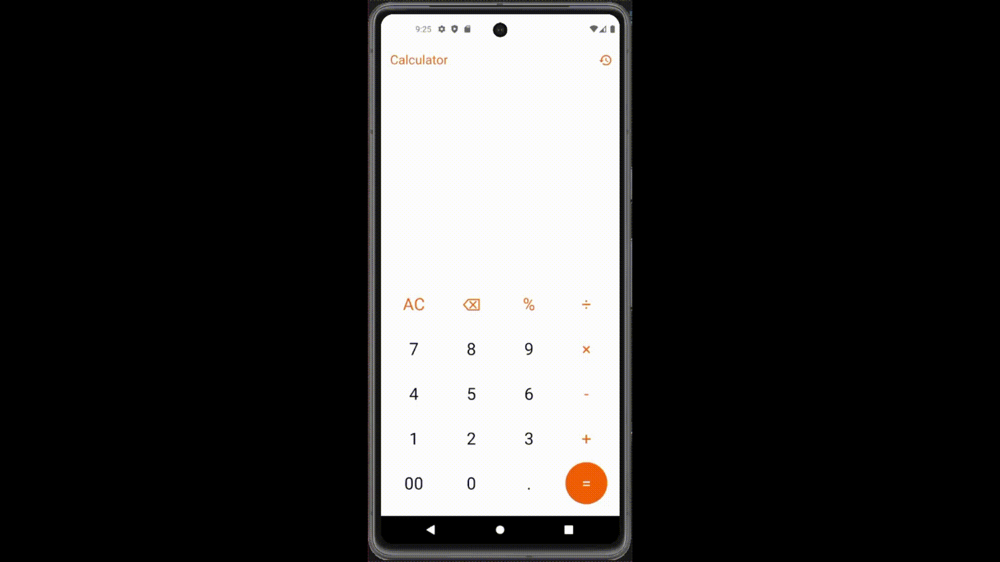

# Calculator App

A minimalist yet powerful calculator application built with Flutter, featuring essential arithmetic operations and calculation history tracking.

 

## Features

- **Core Operations**:  
  ➕ Addition, ➖ Subtraction, ✖️ Multiplication, ➗ Division  
  🔢 Decimal support & percentage calculations  
  🆕 Special inputs: 00 and instant clear (AC)

- **Calculation History**:  
  📖 Automatically stores previous calculations  
  🗑️ One-tap history clearance  
  💾 Persistent storage using Hive database

- **Enhanced UX**:  
  📱 Responsive design for all screen sizes  
  🎨 Clean Material Design interface  
  🚫 Real-time error prevention  
  🔄 Horizontal-scroll equation display

## Setup
    ```bash
     git clone https://github.com/NadaAlaa1/YoungDevInterns_Flutter_Tasks/tree/main/flutter_calculator
     cd flutter-calculator
     flutter pub get

## Dependencies

This project utilizes the following core packages:
  
    ```yaml
    dependencies:
      flutter:
        sdk: flutter
      hive: ^2.2.3
      hive_flutter: ^1.1.0
      math_expressions: ^2.3.0
      provider: ^6.0.5
    
    dev_dependencies:
      flutter_lints: ^2.0.0

### Key Packages:

🗃️ hive: Lightweight local database for history storage

🧮 math_expressions: Mathematical expression parsing and evaluation

🧭 provider: State management solution

🛠️ flutter_lints: Code quality enforcement

## 🤝 Contributing

We welcome contributions from developers of all skill levels! Here's how to get started:

### Contribution Workflow
1. **Fork** the repository  
2. **Clone** your fork locally:  
   ```bash
   git clone https://github.com/your-username/flutter-calculator.git
   
3. **Create** a feature branch:
   ```bash
   git checkout -b feature/your-feature-name

4. **Commit** changes with descriptive messages:
   ```bash
   git commit -m "feat: add scientific notation support"

5. Push to your branch:
   ```bash
   git push origin feature/your-feature-name

6. Open a Pull Request against our `main` branch

